# 1.解题思路描述

## 1.1 从相关网址获取json(爬取数据)
1):

2):

3):
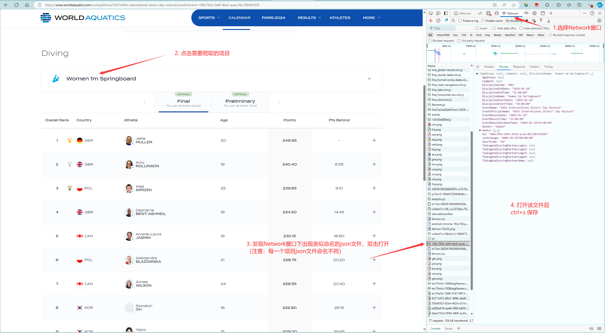
4):

5):

6):
成功爬取后获得以下数据：

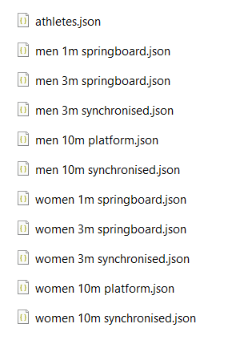
## 1.2 json数据解析

### 1.2.1 atheletes.json解析
    可以将需要的数据分为以下的结构：
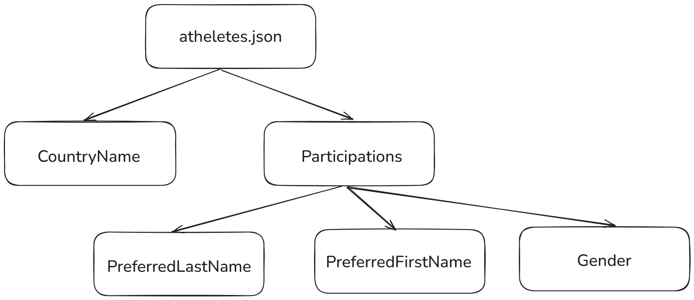

### 1.2.2 contest.json解析
    可以将各个项目中需要的数据分为以下的结构：
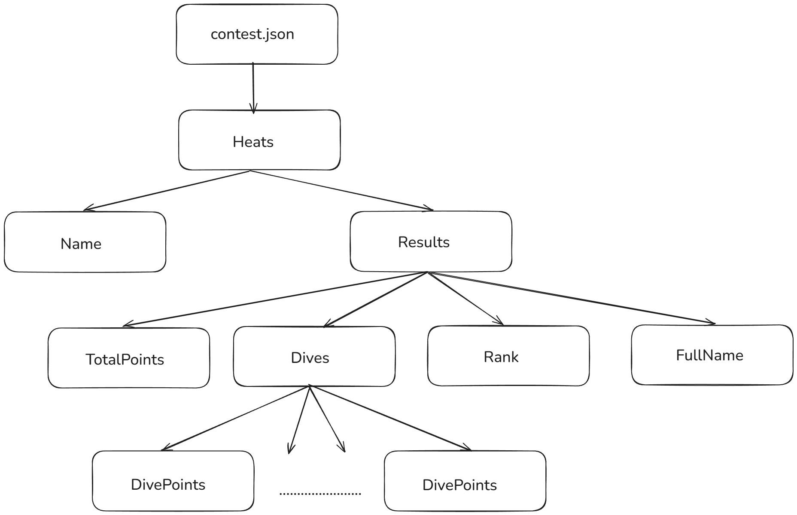

# 2. 接口设计和实现过程

## 2.1 前期准备
### 2.1.1 处理输入输出模块
1): 使用 Utility 类 封装输入输出

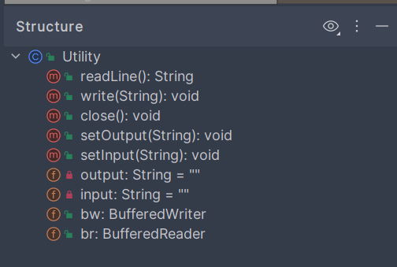

2): 该类底层使用了 BufferedReader 和 BufferedWriter 作为输入/输出流，
    极大地提高了 IO 效率。
### 2.1.2 JavaBean 模块
根据 1.2 json数据解析，构造相应的 JavaBean 类

1): Athlete类，实现基本 getter、setter、constructor、toString方法

该类代表运动员基本信息

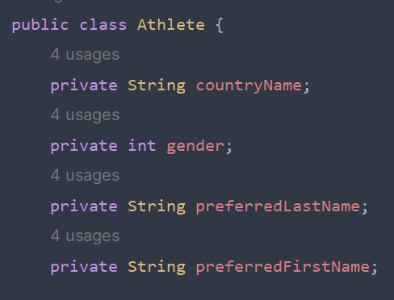

2): Contest类，实现基本 getter、setter、constructor、toString方法

该类代表每位运动员单个项目单场比赛结果

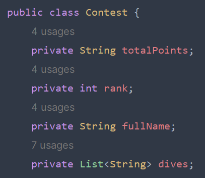

3): ContestDetailed类，实现基本 getter、setter、constructor、toString方法

该类代表每位运动员单个项目所有比赛结果

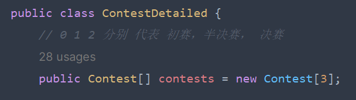

## 2.2 接口设计
    为了提高代码的可维护性和可扩展性，需要将基本功能独立成一个模块，称之为"Core模块"。这个模块包括两个基本功能：
    1.输出所有选手信息
    2.输出每个比赛项目的结果
    这样的设计使得命令行能够共享相同的代码，通过定义清晰的API，实现与其他模块的交流。

    接口名为 CoreModule
    实现方法有：
    1. displayAllPlayersInfo(): 该方法实现了查询所有 player 的基本信息。
    2. displayResults(String contestName, int type):
        该方法实现了 通过给定的 比赛项目 contestName 和 比赛类型 type(0: Preliminary, 1: SemiFinal, 2: Final)
        并将 该比赛项目和类型 的比赛结果 封装到一个集合 List 中返回。
    3. displayResults(String contestName):
        该方法底层调用 方法2, 获得 比赛项目 contestName 中 决赛的比赛结果并输出。
    4. displayDetailedResults(String contestName):
        该方法底层调用 方法2，获得 比赛项目 contestName 中 所有比赛结果并输出。

## 2.3 实现过程
    有上述分析可知，需要先导入阿里巴巴的 fastjson 解析包，调用 fastjson 的 jsonObject 和 jsonArray 解析对应数据。
    再将 解析后数据 封装到 对应的 JavaBean 中，利用 重写的 toString 方法输出
    最后调试代码
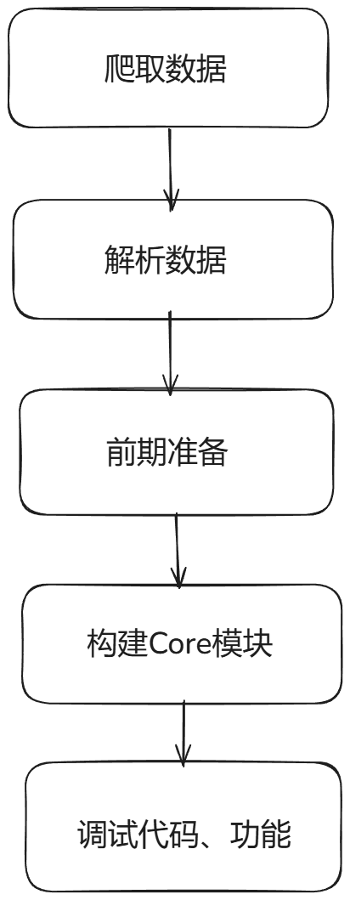

## 2.4 代码展示
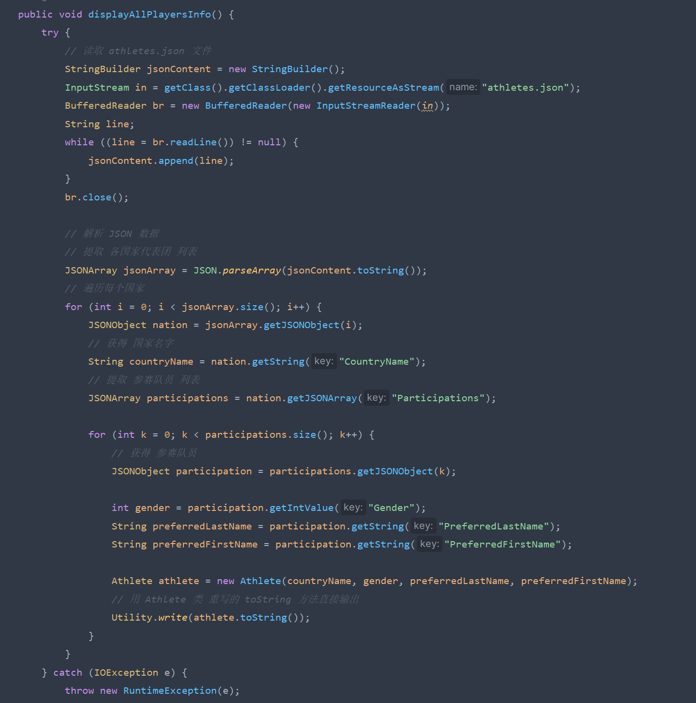
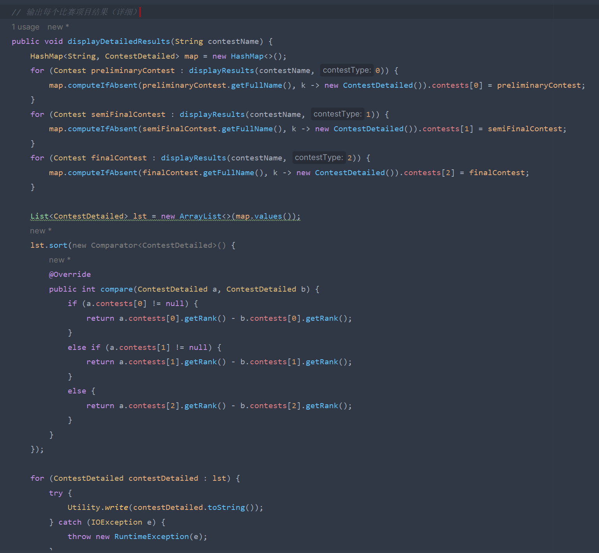
# 3. 性能改进
## 3.1 分析
    性能的优化主要在于I/O流的重复启动。例如如果输入的指令有重复的，则I/O流需要重复操作，不断重复代码的运行，代码运行的重复率较高。
完成较少次数(30次)重复任务需要的时间：
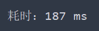

完成大量次数(5000次)重复任务需要的时间：
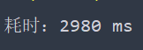

## 3.2 改进计划
    1. 使用hashMap存储key与data充当缓存机制的实现体，key对应的是players这样的命令，
    而data对应的是需要读取进输出文件的内容。这样每次读取指令先对hashMap中的指令进行查找，
    如果查找到了，则将hashMap的内容输出到输出文化，减少了代码运行的计算时间
    2. 使用数据库存储数据，省略了重复IO的过程

# 4.单元测试
对DWASearch.java的单元测试
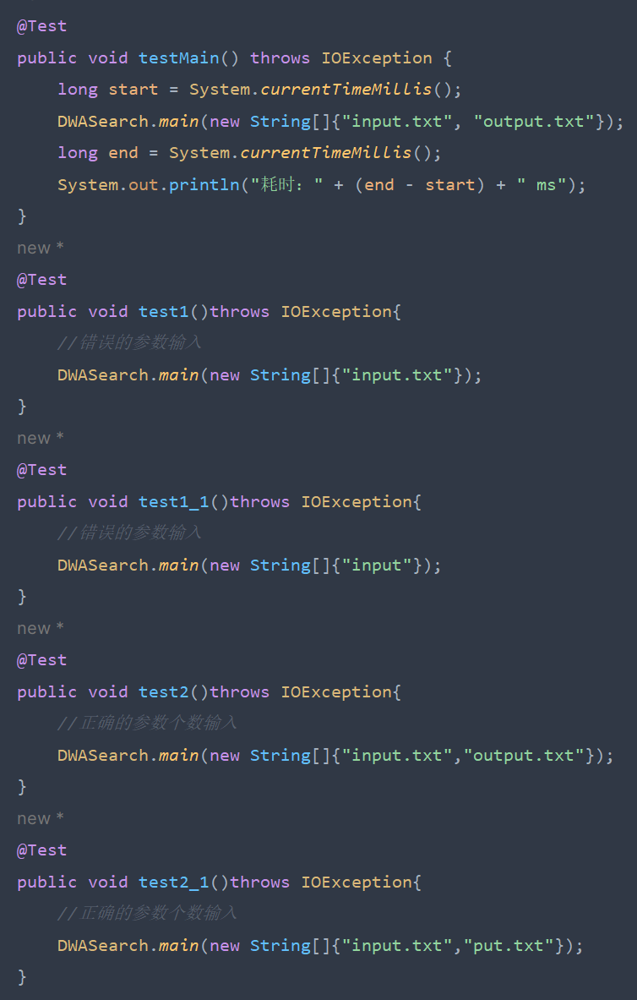

# 5. 异常处理
    1. 使用 try…catch…finally对代码进行维护
    2. 抛出异常，返回给调用者处理

# 6. jar包打包注意事项
使用传统的 相对路径 读入文件方式会报错
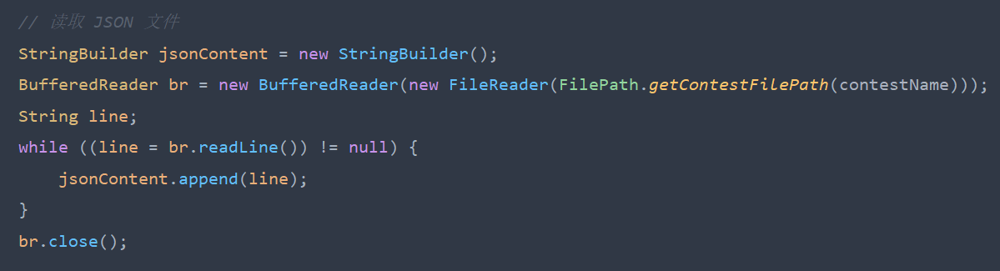
错误信息：
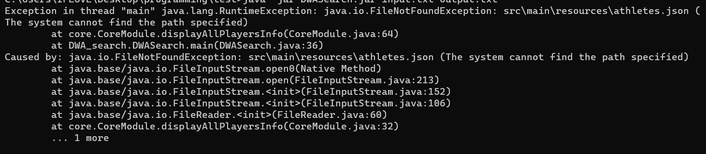

解决方法：
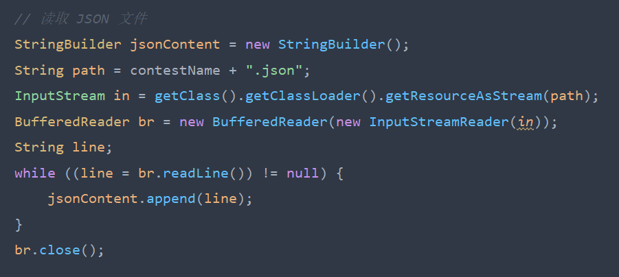
